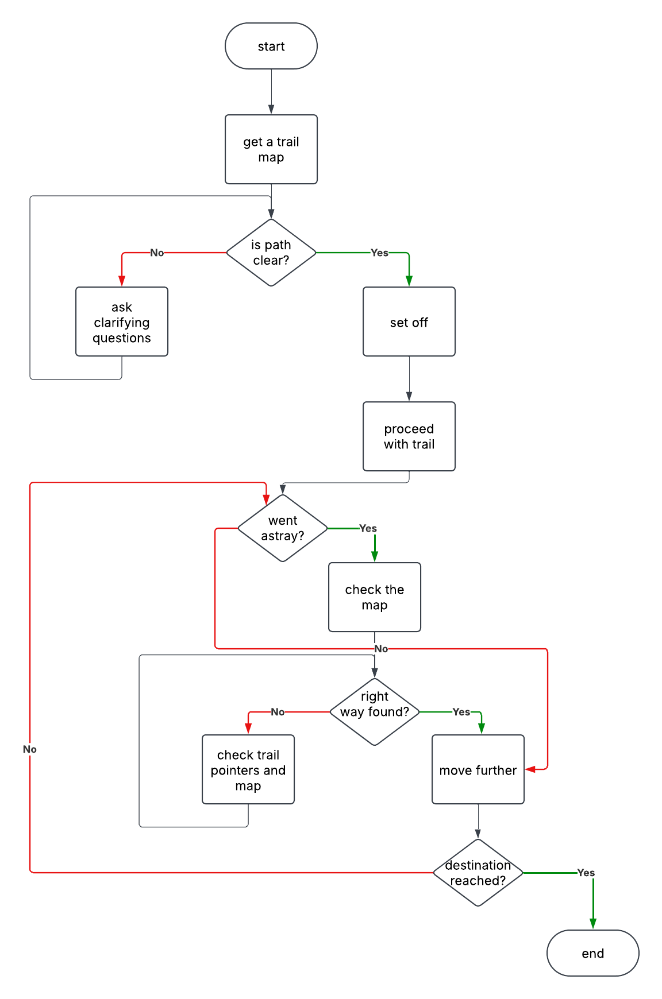
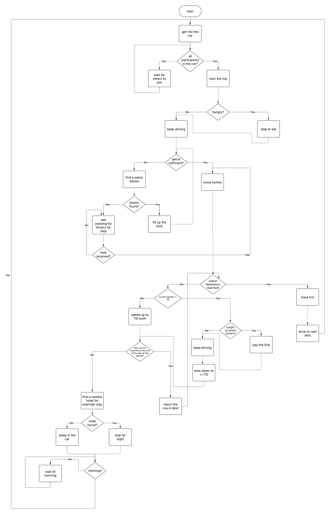
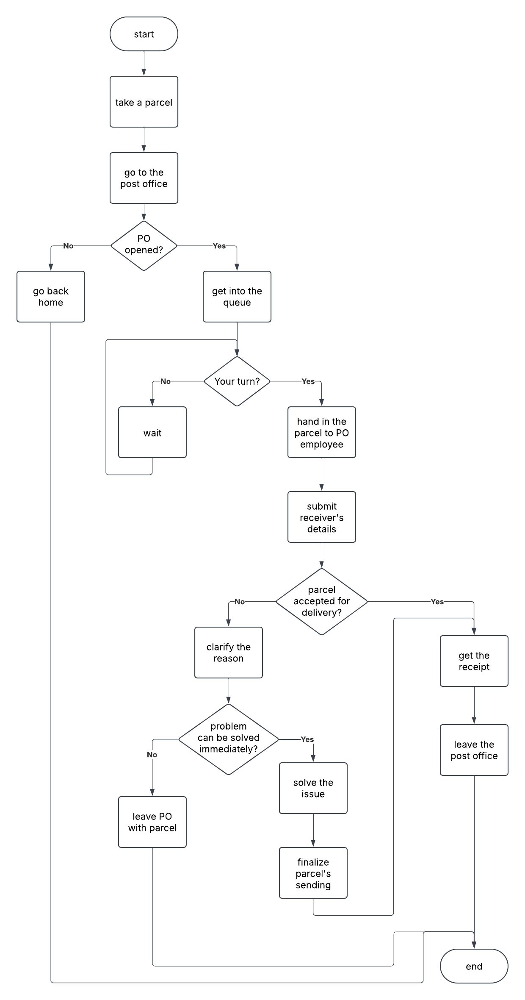

# Visualized algorithms for the following exercises:

### 1. A hiker that is given a random trail

### 2. An eternal road trip with situations like an empty gas tank and a speed camera.

### 3. My own algorithm idea - to send a parcel via Post Office

