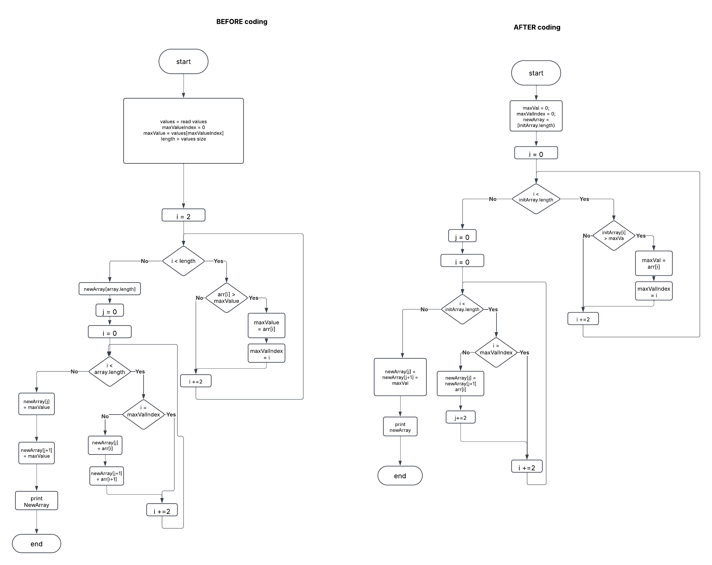

- initialize 2 variables: maxValue and maxValIndex
- traverse the array
- compare numbers with step +2
- if current number > than maxValue -> remember currentNum as maxValue remember its index as maxValIndex
- create new empty array with the same size as initial one
- traverse initial array again with step +2 and copy its values into newArray
- if current index is the index of maxNumber - skip it
- when traversing is over -> add that pair of maxNumbers to the end of the newArray

////////
re-write later in simpler way

### Largest Pair in Array - pre- and post- algorithms

