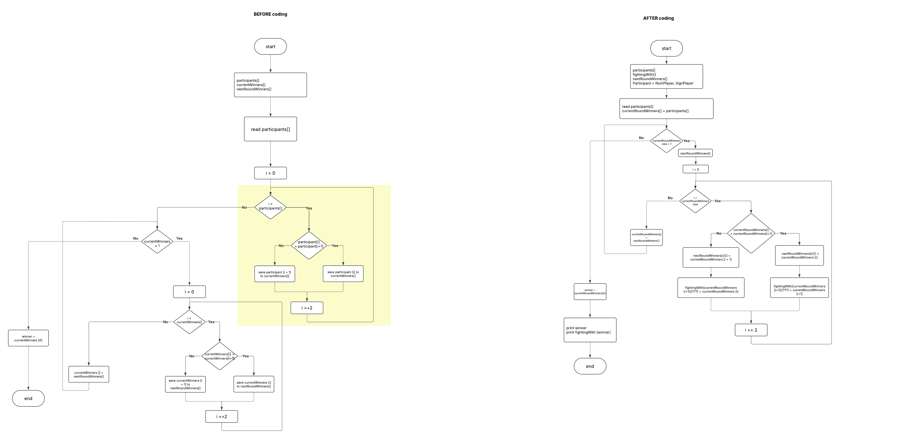

### 
1. Read number of participants
2. Read participants - get Participant Num And Letter
3. Compare each 2 participants defining the winner between them
4. When we reach the end of the list, as the result, we get another list of current round winners
5. If the list of current round winners has more than 1 winner - repeat Step 3

## ALGORITHMS

