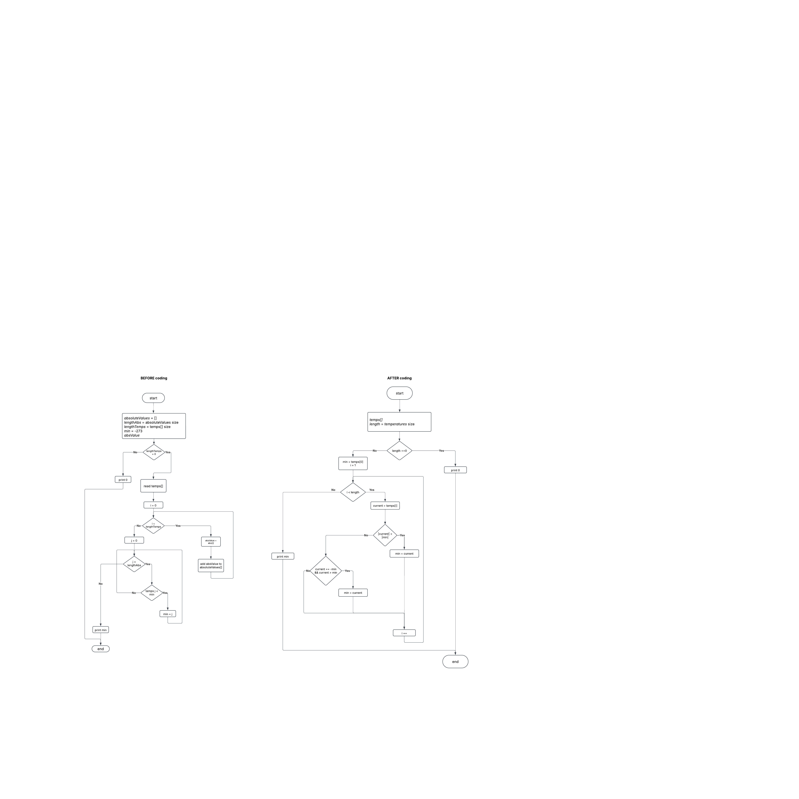

### LOGIC GATES

1. прочитати input дані - зберегти 2 string inputName i inputSignal в мапу наприклад
2. прочитати output дані - зберегти кудись (?????) 
3. здійснити логічні операції над 2 input сигналами

## ALGORITHMS

