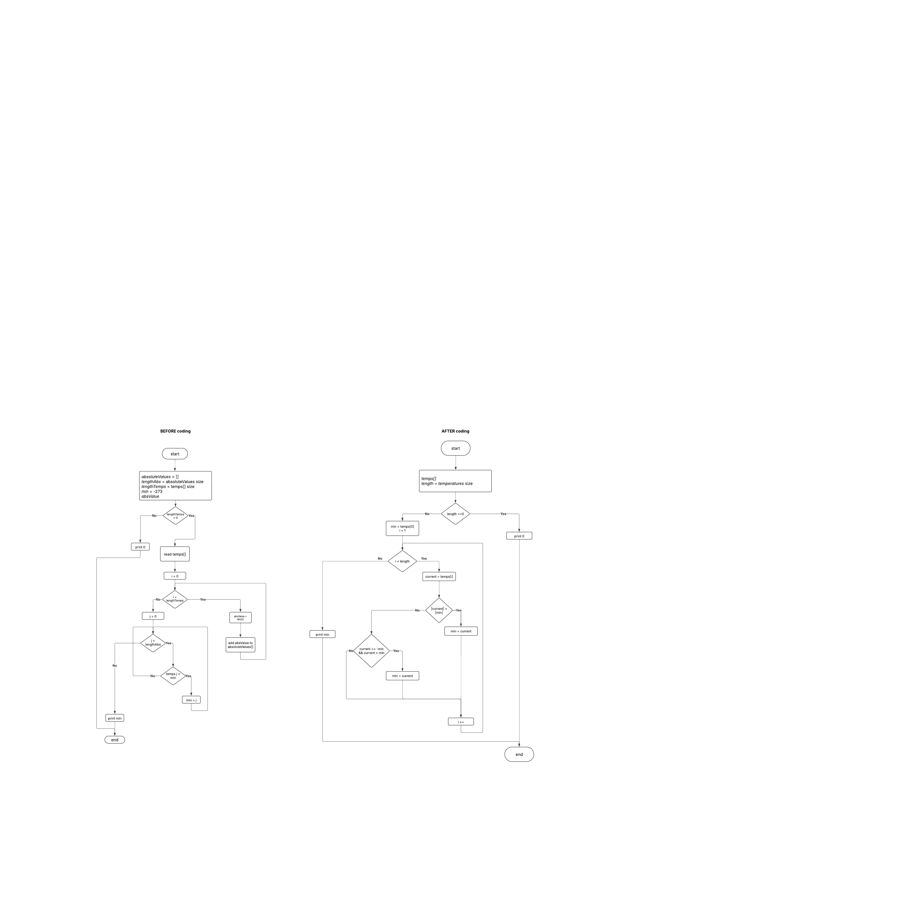

### Print Prime Num
You are given a list of numbers. Print prime numbers whose index corresponds to the sum of the digits in a given number. 
The prime number with index 1 is 2.

1. Взяти 1-ше число
2. порахувати суму його цифр = потрібний індекс
3. йти по всіх числах
   4. рахувати поточний індекс кожного знайденого простого числа
   5. вивести число, якщо воно пройде перевірку, чи воно просте + чи воно знаходиться на тому індексі, який ми шукаємо

    

## ALGORITHMS

